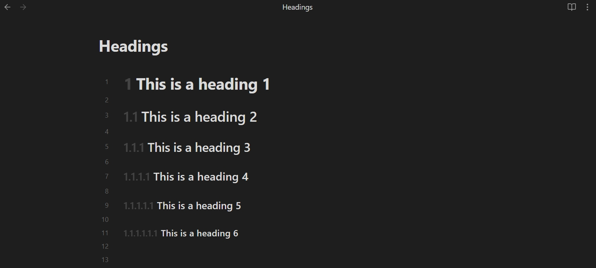
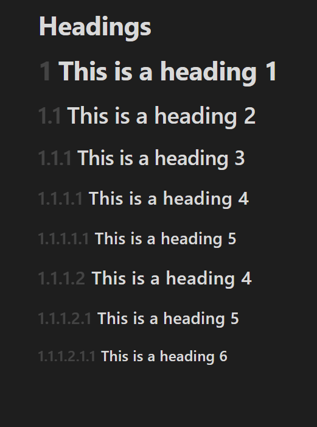
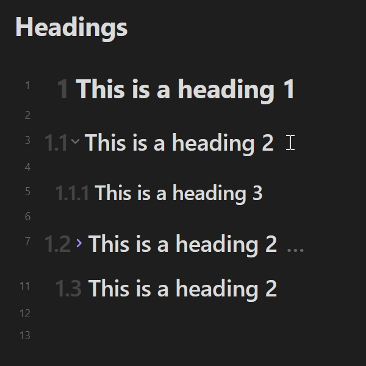
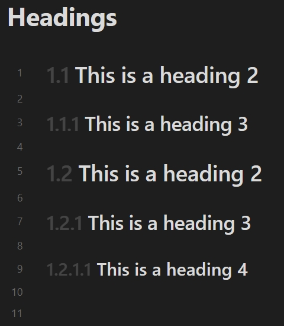
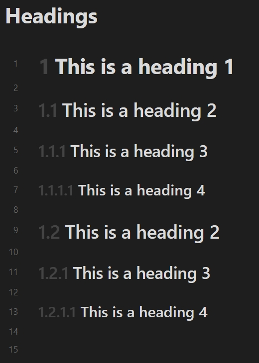
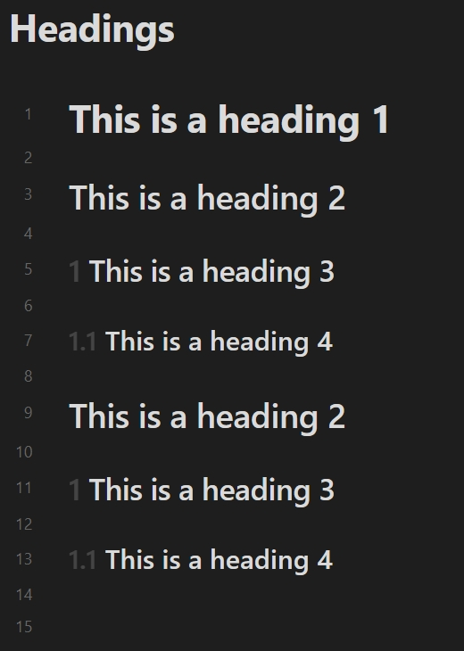
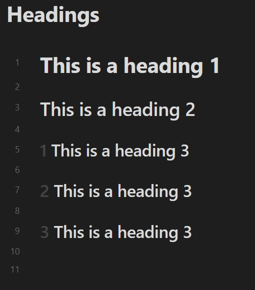

# Heading Decorator

[English](./README.md) | **简体中文** | [繁體中文](./README-zh_TW.md)

## 介绍

这是一个用于 [Obsidian](https://obsidian.md) 的插件，实现根据标题的级别在标题周围显示特定内容。

此插件可选地支持为阅读视图、编辑视图（*实时阅览*和*源码模式*）、*[大纲](https://help.obsidian.md/plugins/outline)*、*[Quiet Outline](https://github.com/guopenghui/obsidian-quiet-outline)* 和 *[Headings in Explorer](https://github.com/patrickchiang/obsidian-headings-in-explorer)* 插件提供装饰。这个插件不修改任何笔记内容，只根据现有的笔记内容装饰标题部分。

## 预览

在*实时阅览*中：



装饰器与折叠按钮之间的交互：



## 设置

### 元数据关键词

从[属性（元数据）](https://help.obsidian.md/Editing+and+formatting/Properties)读取启用状态的键名。默认值为：`heading`。使用参考：[笔记的启用状态](#笔记的启用状态)。

### 启用

插件支持为每个编辑模式配置标题装饰器。您可以控制效果范围：

- **在阅读视图中启用**：允许在*阅读视图*下装饰标题。
- **在实时阅览中启用**：允许在*实时阅览*下装饰标题。
- **在源码模式中启用**：允许在*源码模式*下装饰标题。
- **在大纲插件中启用**：允许在*大纲*插件下装饰标题。
- **在 Quiet Outline 插件中启用**：允许装饰 *[Quiet Outline](https://github.com/guopenghui/obsidian-quiet-outline)* 插件下的标题。
- **在 Headings in Explorer 插件中启用**：允许装饰 *[Headings in Explorer](https://github.com/patrickchiang/obsidian-headings-in-explorer)* 插件下的标题。

此外，您还可以通过*配置*子页面启用每个笔记的默认状态，它主要与[笔记的启用状态](#笔记的启用状态)协同工作。

### 效果

控制装饰器的显示效果。

- **装饰器的模式**：切换此设置可将标题装饰为有序列表、独立层级或无序列表列表。
  - **有序列表**：按照装饰器样式将当前标题级别与顶层标题级别使用分隔符连接起来以构建结果，类似于[预览](#预览)中展示的效果。
  - **独立层级**：默认情况下，按照各自级别装饰器样式将当前标题级别构建结果。
  - **无序列表**：直接将当前标题级别构建为固定字符串。
- **装饰器的不透明度**：设置标题装饰器的不透明度。值是百分比的形式。
- **装饰器的位置**：设置标题装饰器的位置。您可以将内容配置为显示在标题之前或之后。
- **所识别的最大级别**：指定所识别标题的最大级别，不处理高于此级别的标题。

不同装饰器模式示例：

| 有序列表 (十进制数字) | 独立层级 | 无序列表 (使用 `H1 H2 H3 H4 H5 H6`) |
| :---------------: | :-----: | :-------------------------------: |
|  |  |  |

不同装饰器位置之间的差异示例：

| 在标题之前 | 在标题之前 (内部) | 在标题之后 |
| :------: | :------------: | :------: |
|  |  |  |

以下是不同的所识别最大级别示例：

| 所识别的最大级别为 `6` | 所识别的最大级别为 `4` |
| :----------------: | :-----------------: |
|  |  |

#### 独立层级的特殊设置

##### 使用有序列表的级别

将装饰器的模式设置为独立层级时出现的设置，指示在标题级别超出指定级别后按有序列表进行构建。例如：

| 默认 (*设置值为 `6`*) | 设置值为 `4` |
| :----------------: | :---------: |
|  |  |

### 装饰器样式

您可以控制计数器的样式类型和分隔符。存在两种特殊的计数器样式：

- **自定义列表样式**：为装饰器设置自定义列表样式。使用空格分隔条目。
- **指定字符串**：为装饰器设置指定的字符串。

示例：

| 十进制数字 | 自定义列表样式 (使用 `Ⓐ Ⓑ Ⓒ`) | 指定字符串 (使用 `#` 以及空分隔符) |
| :------: | :-------------------------: | :---------------------------: |
|  |  |  |

### 逻辑控制

在将装饰器的模式设置为有序列表或独立层级时，您可以控制标题的渲染逻辑，用于调整渲染结果或者忽略掉不想处理的标题级别。

#### 允许零级别

对于*允许零级别*设置，如果下一个标题高出一个以上的级别，则省略的级别为零而不是一。例如：

| 默认 | 允许零级别 |
| :--: | :-----: |
|  |  |

#### 基于现有的最高级别

对于*基于现有的最高级别*设置，将使用笔记中最高级别的标题作为构建装饰器的基础。例如：

| 默认 | 基于现有的最高级别 |
| :--: | :------------: |
|  |  |

#### 始终忽略顶层的标题

在构建装饰器时将顶层的标题排除掉，受*忽略的最大层级数量*选项控制。例如：

| 默认 | 始终忽略顶层的标题 (忽略的最大层级数量为 `2`) |
| :--: | :----------------------------------: |
|  |  |

#### 忽略顶层的独立标题

对于*忽略顶层的独立标题*设置，如果顶层只有一个标题，则在构建装饰器时将其排除，受*忽略的最大层级数量*选项控制。此设置包含*基于现有的最高级别*，但它处理得更为“激进”。例如：

| 默认 | 启用 (忽略的最大层级数量为 `1`) | 启用 (忽略的最大层级数量为 `6`) |
| :--: | :-----------------------: | :------------------------: |
|  |  |  |

### 阅读视图的其他设置

#### 阅读视图的渲染策略

在编辑笔记内容时阅读视图里标题装饰器的渲染策略：

- **部分渲染**：在更新后只重新渲染活动标题装饰器。
- **全部渲染**：在更新后重新渲染所有标题装饰器。

### 源码模式的其他设置

#### 隐藏非活动行上的井字符

隐藏非活动行上的井字符(`#`)，类似于实时阅览。

### 阻止列表

#### 文件夹阻止列表

禁用指定文件夹内笔记中的标题装饰器。对于处于阻止列表中的笔记，您仍然可以使用[笔记的启用状态](#笔记的启用状态)。

#### 笔记名称正则表达式阻止列表

禁用笔记名称与指定正则表达式匹配的笔记中的标题装饰器。格式使用 [JavaScript 正则表达式](https://developer.mozilla.org/en-US/docs/Web/JavaScript/Guide/Regular_expressions)，例如：`/^daily.*/i`。对于处于阻止列表中的笔记，您仍然可以使用[笔记的启用状态](#笔记的启用状态)。

## 笔记的启用状态

此插件允许根据笔记[属性](https://help.obsidian.md/Editing+and+formatting/Properties)中的特定字段配置启用状态。您可以单独控制笔记的启用状态。

您可以在配置的属性[关键词](#元数据关键词)后指定状态，例如：

```yaml
---
heading: false
---
```

值 `true`、`yes`、`on` 或 `1` 表示启用；值 `false`、`no`、`off` 或 `0` 表示禁用。其他值等同于未声明。

您还可以使用以下子字段指定特定模式的状态：

- **reading**: 装饰器在阅读视图中的状态。
- **preview**: 装饰器在实时阅览中的状态。
- **source**: 装饰器在源码模式下的状态。
- **outline**: 装饰器在大纲插件中的状态。
- **quiet-outline**: 装饰器在 Quiet Outline 插件中的状态。
- **file-explorer**: 装饰器在 Headings in Explorer 插件中的状态。
- **all**: 装饰器在所有模式下的状态。

例如，您可以将所有其他模式设置为禁用状态，并仅在阅读视图中单独启用装饰器：

```yaml
---
heading:
  all: false
  reading: true
---
```

如果您更喜欢使用 Obsidian 的默认属性 `cssclasses`，您也可以在 `cssclasses` 中填写一些等价的类名：

- reading: `enable-reading-heading`/`disable-reading-heading`
- preview: `enable-preview-heading`/`disable-preview-heading`
- source: `enable-source-heading`/`disable-source-heading`
- outline: `enable-outline-heading`/`disable-outline-heading`
- quiet-outline: `enable-quiet-outline-heading`/`disable-quiet-outline-heading`
- file-explorer: `enable-file-explorer-heading`/`disable-file-explorer-heading`
- all: `enable-heading`/`disable-heading`

例如，一个与上述示例相等的值：

```yaml
---
cssclasses:
  - disable-heading
  - enable-reading-heading
---
```

## 自定义装饰器样式

您可以通过 CSS 类自定义标题装饰器样式。对于编辑器中的装饰器，可以使用 `.custom-heading-decorator`。或者针对特定的编辑器模式：

- 阅读视图：`.reading-custom-heading-decorator`
- 实时阅览：`.preview-custom-heading-decorator`
- 源码模式：`.source-custom-heading-decorator`

对于其他插件中的装饰器，需要组合伪元素关键词：

- 大纲: `.outline-custom-heading-decorator::before` 或 `.outline-custom-heading-decorator::after`
- Quiet Outline: `.quiet-outline-custom-heading-decorator::before` 或 `.quiet-outline-custom-heading-decorator::after`
- Headings in Explorer: `.file-explorer-custom-heading-decorator::before` 或 `.file-explorer-custom-heading-decorator::after`

每个装饰元素都有一个与当前标题级别相关联的属性 `[data-decorator-level="n"]` (*`n` 为标题级别*)。

例如，使所有装饰器显示为绿色：

```css
.custom-heading-decorator,
.outline-custom-heading-decorator::before,
.outline-custom-heading-decorator::after,
.quiet-outline-custom-heading-decorator::before,
.quiet-outline-custom-heading-decorator::after,
.file-explorer-custom-heading-decorator::before,
.file-explorer-custom-heading-decorator::after {
  color: green;
}
```

此外，此插件还提供了一组 CSS 变量，用于自定义装饰器的间距：

- `--reading-heading-decorator-margin`: 阅读视图中标题装饰器的间距。
- `--reading-heading-decorator-translate`: 阅读视图中标题装饰器的动画平移距离。
- `--preview-heading-decorator-margin`: 实时阅览中标题装饰器的间距。
- `--preview-heading-decorator-translate`: 实时阅览中标题装饰器的动画平移距离。
- `--source-heading-decorator-margin`: 源码模式中标题装饰器的间距。
- `--source-heading-decorator-translate`: 源码模式中标题装饰器的动画平移距离。
- `--outline-heading-decorator-margin`: 大纲插件中标题装饰器的间距。
- `--quiet-outline-heading-decorator-margin`: Quiet Outline 插件中标题装饰器的间距。
- `--file-explorer-heading-decorator-margin`: Headings in Explorer 插件中标题装饰器的间距。

例如，将阅读视图中标题装饰器的间距调整为 `8px`：

```css
body {
  --reading-heading-decorator-margin: 8px;
}
```

## 致谢

- [@jsamr/counter-style](https://github.com/jsamr/react-native-li/tree/master/packages/counter-style#readme)

## 许可

[MIT](/LICENSE)
