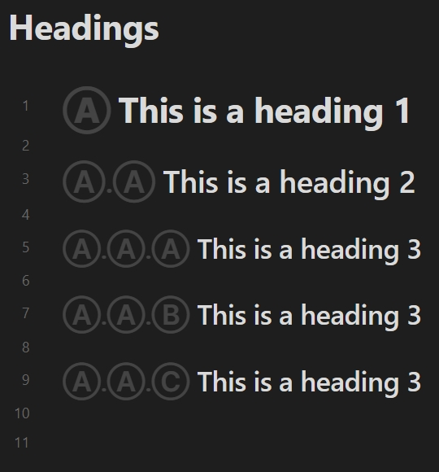
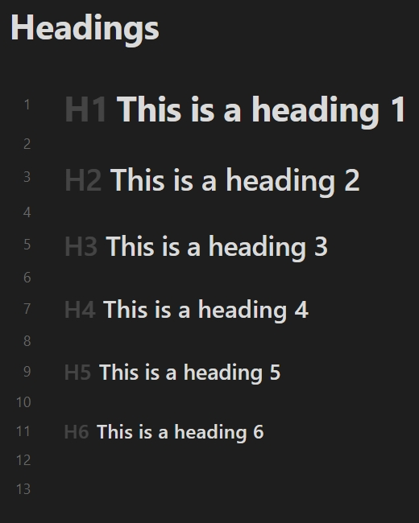

# Heading Decorator

[English](./README.md) | [简体中文](./README-zh_CN.md) | **繁體中文**

## 介紹

這是一個用於 [Obsidian](https://obsidian.md) 的外掛，實現根據標題的級別在標題周圍顯示特定內容。

此外掛可選地支援為閱讀、編輯檢視（*實際預覽*和*原始碼模式*）、*[大綱](https://help.obsidian.md/plugins/outline)*、*[Quiet Outline](https://github.com/guopenghui/obsidian-quiet-outline)* 和 *[Headings in Explorer](https://github.com/patrickchiang/obsidian-headings-in-explorer)* 外掛提供裝飾。這個外掛不修改任何筆記內容，只根據現有的筆記內容裝飾標題部分。

## 預覽

在*實際預覽*中：


裝飾器與收合按鈕之間的互動：


## 設定

### 元資料關鍵詞

從[屬性（元資料）](https://help.obsidian.md/Editing+and+formatting/Properties)讀取啟用狀態的鍵名。預設值為：`heading`。使用參考：[筆記的啟用狀態](#筆記的啟用狀態)。

### 啟用

外掛支援為每個編輯模式配置標題裝飾器。您可以控制效果範圍：

- **在閱讀中啟用**：允許在*閱讀*下裝飾標題。
- **在實際預覽中啟用**：允許在*實際預覽*下裝飾標題。
- **在原始碼模式中啟用**：允許在*原始碼模式*下裝飾標題。
- **在大綱外掛中啟用**：允許在*大綱*外掛下裝飾標題。
- **在 Quiet Outline 外掛中啟用**：允許裝飾 *[Quiet Outline](https://github.com/guopenghui/obsidian-quiet-outline)* 外掛下的標題。
- **在 Headings in Explorer 外掛中啟用**：允許裝飾 *[Headings in Explorer](https://github.com/patrickchiang/obsidian-headings-in-explorer)* 外掛下的標題。

此外，您還可以透過*管理*子頁面啟用每個筆記的預設狀態，它主要與[筆記的啟用狀態](#筆記的啟用狀態)協同工作。

### 效果

控制裝飾器的顯示效果。

- **有序列表**：切換此設定可將標題裝飾為[有序](#有序列表)或[無序](#無序列表)列表。
- **不透明度**：設定標題裝飾器的不透明度。值是百分比的形式。
- **位置**：設定標題裝飾器的位置。您可以將內容配置為顯示在標題之前或之後。

以下是一些不同位置之間的差異示例：

| 在標題之前 | 在標題之前 (內部) | 在標題之後 |
| :------: | -------------: | :------: |
|  |  |  |

### 有序列表

類似於[預覽](#預覽)中展示的效果。

您可以控制計數器的樣式型別和分隔符。存在兩種特殊的計數器樣式：

- **自定義列表樣式**：為有序列表設定自定義列表樣式。使用空格分隔條目。
- **指定字串**：為有序列表設定指定的字串。

示例：

| 十進位制數字 | 自定義列表樣式 (使用 `Ⓐ Ⓑ Ⓒ`) | 指定字串 (使用 `#` 以及空分隔符) |
| :-------: | :--------------------------: | :-------------------------: |
|  |  |  |

#### 允許零級別

對於*允許零級別*設定，如果下一個標題高出一個以上的級別，則省略的級別為零而不是一。例如：

| 預設 | 允許零級別 |
| :--: | :-----: |
|  |  |

#### 基於現有的最高級別

對於*基於現有的最高級別*設定，將使用筆記中最高級別的標題作為有序列表的基礎。例如：

| 預設 | 基於現有的最高級別 |
| :--: | :------------: |
|  |  |

#### 始終忽略頂層的標題

在構建有序列表時將頂層的標題排除掉，受*忽略的最大層級數量*選項控制。例如：

| 預設 | 始終忽略頂層的標題 (忽略的最大層級數量為 `2`) |
| :--: | :------------------------------------:|
|  |  |

#### 忽略頂層的獨立標題

對於*忽略頂層的獨立標題*設定，如果頂層只有一個標題，則在構建有序列表時將其排除，受*忽略的最大層級數量*選項控制。此設定包含*基於現有的最高級別*，但它處理得更為“激進”。例如：

| 預設 | 忽略頂層的獨立標題 (忽略的最大層級數量為 `1`) | 忽略頂層的獨立標題 (忽略的最大層級數量為 `6`) |
| :--: | :-----------------------------------: | :-----------------------------------: |
|  |  |  |

### 無序列表

直接根據級別裝飾標題。例如：

| 有序列表 (十進位制數字) | 無序列表 (使用 `H1 H2 H3 H4 H5 H6`) |
| :---------------: | :-------------------------------: |
|  |  |

### 原始碼模式的其他設定

#### 隱藏非活動行上的井字元

隱藏非活動行上的井字元(`#`)，類似於實際預覽。

### 阻止列表

#### 資料夾阻止列表

停用指定資料夾內筆記中的標題裝飾器。對於處於阻止列表中的筆記，您仍然可以使用[筆記的啟用狀態](#筆記的啟用狀態)。

#### 筆記名稱正則表示式阻止列表

停用筆記名稱與指定正則表示式匹配的筆記中的標題裝飾器。格式使用 [JavaScript 正則表示式](https://developer.mozilla.org/en-US/docs/Web/JavaScript/Guide/Regular_expressions)，例如：`/^daily.*/i`。對於處於阻止列表中的筆記，您仍然可以使用[筆記的啟用狀態](#筆記的啟用狀態)。

## 筆記的啟用狀態

此外掛允許根據筆記[屬性](https://help.obsidian.md/Editing+and+formatting/Properties)中的特定欄位配置啟用狀態。您可以單獨控制筆記的啟用狀態。

您可以在配置的屬性[關鍵詞](#元資料關鍵詞)後指定狀態，例如：

```yaml
---
heading: false
---
```

值 `true`、`yes`、`on` 或 `1` 表示啟用；值 `false`、`no`、`off` 或 `0` 表示停用。其他值等同於未宣告。

您還可以使用以下子欄位指定特定模式的狀態：

- **reading**: 裝飾器在閱讀中的狀態。
- **preview**: 裝飾器在實際預覽中的狀態。
- **source**: 裝飾器在原始碼模式下的狀態。
- **outline**: 裝飾器在大綱外掛中的狀態。
- **quiet-outline**: 裝飾器在 Quiet Outline 外掛中的狀態。
- **file-explorer**: 裝飾器在 Headings in Explorer 外掛中的狀態。
- **all**: 裝飾器在所有模式下的狀態。

例如，您可以將所有其他模式設定為停用狀態，並僅在閱讀中單獨啟用裝飾器：

```yaml
---
heading:
  all: false
  reading: true
---
```

如果您更喜歡使用 Obsidian 的預設屬性 `cssclasses`，您也可以在 `cssclasses` 中填寫一些等價的類名：

- reading: `enable-reading-heading`/`disable-reading-heading`
- preview: `enable-preview-heading`/`disable-preview-heading`
- source: `enable-source-heading`/`disable-source-heading`
- outline: `enable-outline-heading`/`disable-outline-heading`
- quiet-outline: `enable-quiet-outline-heading`/`disable-quiet-outline-heading`
- file-explorer: `enable-file-explorer-heading`/`disable-file-explorer-heading`
- all: `enable-heading`/`disable-heading`

例如，一個與上述示例相等的值：

```yaml
---
cssclasses:
  - disable-heading
  - enable-reading-heading
---
```

## 自定義裝飾器樣式

您可以透過 CSS 類自定義標題裝飾器樣式。對於編輯器中的裝飾器，可以使用 `.custom-heading-decorator`。或者針對特定的編輯器模式：

- 閱讀：`.reading-custom-heading-decorator`
- 實際預覽：`.preview-custom-heading-decorator`
- 原始碼模式：`.source-custom-heading-decorator`

對於其他外掛中的裝飾器，需要組合偽元素關鍵詞：

- 大綱: `.outline-custom-heading-decorator::before` 或 `.outline-custom-heading-decorator::after`
- Quiet Outline: `.quiet-outline-custom-heading-decorator::before` 或 `.quiet-outline-custom-heading-decorator::after`
- Headings in Explorer: `.file-explorer-custom-heading-decorator::before` 或 `.file-explorer-custom-heading-decorator::after`

例如，使所有裝飾器顯示為綠色：

```css
.custom-heading-decorator,
.outline-custom-heading-decorator::before,
.outline-custom-heading-decorator::after,
.quiet-outline-custom-heading-decorator::before,
.quiet-outline-custom-heading-decorator::after,
.file-explorer-custom-heading-decorator::before,
.file-explorer-custom-heading-decorator::after {
  color: green;
}
```

此外，此外掛還提供了一組 CSS 變數，用於自定義裝飾器的間距：

- `--reading-heading-decorator-margin`: 閱讀中標題裝飾器的間距。
- `--reading-heading-decorator-translate`: 閱讀中標題裝飾器的動畫平移距離。
- `--preview-heading-decorator-margin`: 實際預覽中標題裝飾器的間距。
- `--preview-heading-decorator-translate`: 實際預覽中標題裝飾器的動畫平移距離。
- `--source-heading-decorator-margin`: 原始碼模式中標題裝飾器的間距。
- `--source-heading-decorator-translate`: 原始碼模式中標題裝飾器的動畫平移距離。
- `--outline-heading-decorator-margin`: 大綱外掛中標題裝飾器的間距。
- `--quiet-outline-heading-decorator-margin`: Quiet Outline 外掛中標題裝飾器的間距。
- `--file-explorer-heading-decorator-margin`: Headings in Explorer 外掛中標題裝飾器的間距。

例如，將閱讀中標題裝飾器的間距調整為 `8px`：

```css
body {
  --reading-heading-decorator-margin: 8px;
}
```

## 致謝

- [@jsamr/counter-style](https://github.com/jsamr/react-native-li/tree/master/packages/counter-style#readme)

## 許可

[MIT](/LICENSE)
