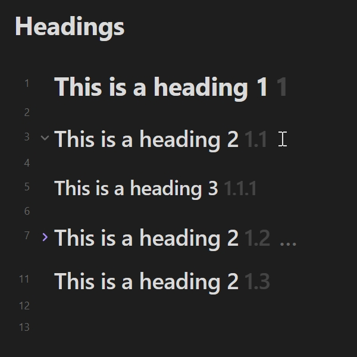
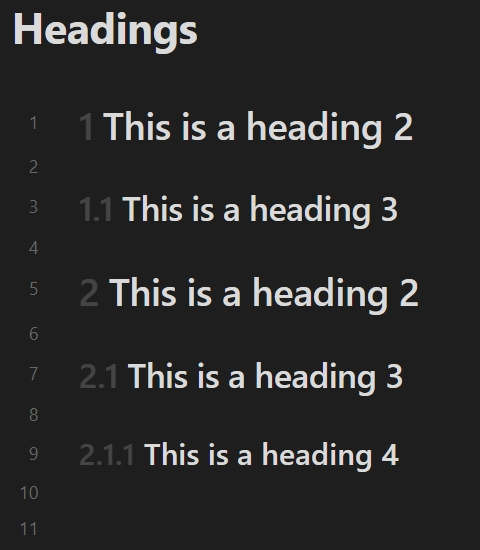

# Heading Decorator

**English** | [简体中文](./README-zh_CN.md) | [繁體中文](./README-zh_TW.md)

## Introduction

This is a plugin for [Obsidian](https://obsidian.md).

Implement displaying specific content around headings based on their levels.

This plugin supports optional decoration for reading view, editing view (*Live Preview* and *Source mode*), *[Outline](https://help.obsidian.md/plugins/outline)*, *[Quiet Outline](https://github.com/guopenghui/obsidian-quiet-outline)* and *[Headings in Explorer](https://github.com/patrickchiang/obsidian-headings-in-explorer)* plugin. This plugin does not modify any note content, only decorates the heading section based on the existing note content.

## Preview

In *Live Preview*:


The interaction between the decorator and the collapse button:


## Settings

### Metadata keyword

The key name that reads the enabled status from the [properties](https://help.obsidian.md/Editing+and+formatting/Properties). The default value is: `heading`. Usage reference: [Enabled status of notes](#enabled-status-of-notes).

### Enabled

The plugin supports configure heading decorator for each editor mode. You can control the effect range:

- **Enabled in reading view**: Allow to decorate the heading under the *Reading* view.
- **Enabled in live preview**: Allow to decorate the heading under the *Live Preview*.
- **Enabled in source mode**: Allow to decorate the heading under the *Source mode*.
- **Enabled in outline plugin**: Allow to decorate the heading under the *Outline* plugin.
- **Enabled in "Quiet Outline" plugin**: Allow to decorate the heading under the *[Quiet Outline](https://github.com/guopenghui/obsidian-quiet-outline)* plugin.
- **Enabled in "Headings in Explorer" plugin**: Allow to decorate the heading under the *[Headings in Explorer](https://github.com/patrickchiang/obsidian-headings-in-explorer)* plugin.

In addition, you can enable the default status of each note within the *Config* subpage. It mainly works together with [Enabled status of notes](#enabled-status-of-notes).

### Effect

Control the display effect of the decorator.

- **Mode**: Toggle this setting to decorate headings as ordered, independent, splice or unordered.
  - **Ordered**: Connect the current heading level with the top-level heading level using a separator in the decorator style to build the result, similar to the effect shown in [Preview](#preview).
  - **Independent**: By default, build the result of the current heading level according to the decorator style of each level.
  - **Splice**: The result is builded by connecting the current heading level with the top-level heading level using a separator, following the respective level decorator style.
  - **Unordered**: Build the current heading level directly as a fixed string.
- **Opacity**: Set the opacity of the heading decorator. The value is the form of percentage.
- **Position**: Set the position of the heading decorator. You can configure the content to appear before or after the heading.
- **Maximum level recognized**: Specify the maximum level of headings to be recognized, ignoring headings above this level.

Examples of differences between different decorator modes:

| Ordered (Decimal numbers) | Independent | Splice | Unordered (using `H1 H2 H3 H4 H5 H6`) |
| :-----------------------: | :---------: | :----: | :-----------------------------------: |
|  |  |  |  |

Examples of differences between different decorator positions:

| Before the heading | Before the heading (inside) | After the heading |
| :----------------: | :-------------------------: | :---------------: |
|  |  |  |

Here are examples of different recognized maximum levels:

| The maximum level recognized is `6` | The maximum level recognized is `4` |
| :---------------------------------: | :---------------------------------: |
|  |  |

#### Special settings for independent

##### Level using ordered list

When the heading level exceeds the specified level, build it as an ordered list. For example:

| Default (*setting is `6`*) | Setting is `4` |
| :------------------------: | :------------: |
|  |  |

### Decorator Style

You can control the counter style type and delimiter. There are two special types of counter styles:

- **Custom list styles**: Set custom list styles for decorator. Using spaces to separate entries.
- **Specified string**: Set a specified string for decorator.

For example:

| Decimal numbers | Custom List Styles (using `Ⓐ Ⓑ Ⓒ`) | Specified String (using `#` with empty delimiter) |
| :-------------: | :----------------------------------: | :-----------------------------------------------: |
|  |  |  |

### Logic

When you set the decorator mode to ordered, independent or splice, you can control the rendering logic of headings to adjust rendering results, or ignore heading levels you don't want to handle.

#### Allow zero level

For the *Allow zero level* setting, if the next heading is more than one level higher, the omitted level is zero instead of one. For example:

| Default | Allow zero level |
| :-----: | :--------------: |
|  |  |

#### Based on the existing highest level

For the *Based on the existing highest level* setting, use the highest level of headings in the note as the base for building decorators. For example:

| Default | Based on the existing highest level |
| :-----: | :----------------------------------: |
|  |  |

#### Always ignore the top-level headings

Exclude the top-level heading when building decorators. controlled by the *Maximum number of ignored levels* option. For example:

| Default | Enabled (Maximum number of ignored levels set to `2`) |
| :-----: | :---------------------------------------------------: |
|  |  |

#### Ignore the single heading at the top-level

For the *Ignore the single heading at the top-level* setting, if the top-level has only a single heading, exclude it when building decorators. controlled by the *Maximum number of ignored levels* option. This setting contains *Based on the existing highest level*, but it deals with more "aggressive". For example:

| Default | Enabled (Maximum ignored levels: `1`) | Enabled  (Maximum ignored levels: `6`) |
| :-----: | :-----------------------------------: | :------------------------------------: |
|  |  |  |

### Editor display

Render heading decorations in a gutter column instead of inline with the text. Applies to both live preview and source mode. For details, see [#24](https://github.com/dragonish/obsidian-heading-decorator/issues/24). Preview effect:


### Other settings for reading view

#### Render policy for reading view

When editing note content, the render policy used by the heading decorator in the reading view.

- **Partial**: Rerender active heading decorator after the update.
- **Full**: Rerender all heading decorators after the update.

### Other settings for source mode

#### Hide number signs on inactive lines

Hide number signs (`#`) on inactive lines similar to live preview.

### Blocklist

#### Folder blocklist

Disables the heading decorator in notes within the specified folder. For notes that are on the blocklist, you can still use [Enabled status of notes](#enabled-status-of-notes).

#### Note name regex blocklist

Disables the heading decorator in notes whose note name matches the specified regular expression. The format uses [JavaScript regular expression](https://developer.mozilla.org/en-US/docs/Web/JavaScript/Guide/Regular_expressions), for example: `/^daily.*/i`. For notes that are on the blocklist, you can still use [Enabled status of notes](#enabled-status-of-notes).

## Enabled status of notes

This plugin allows for configure the enabled status based on specific fields in the note [properties](https://help.obsidian.md/Editing+and+formatting/Properties). You can individually control the enabled status of a note.

You can specify the status after the configured property [keyword](#metadata-keyword):

```yaml
---
heading: false
---
```

The values `true`, `yes`, `on` or `1` indicates enabled; the values `false`, `no`, `off` or `0` indicates disabled. Other values are equivalent to undeclared.

You can also use the following subfields to specify the status of a specific mode:

- **reading**: the status of the decorator in the reading view.
- **preview**: the status of the decorator in the live preview.
- **source**: the status of the decorator in the source mode.
- **outline**: the status of the decorator in the outline plugin.
- **quiet-outline**: the status of the decorator in the "Quiet Outline" plugin.
- **file-explorer**: the status of the decorator in the "Headings in Explorer" plugin.
- **all**: the status of the decorator in all modes.

For example, you can set all other modes to be disabled and enable the decorator in the reading view alone:

```yaml
---
heading:
  all: false
  reading: true
---
```

If you prefer to use Obsidian's default property `cssclasses`, you can also fill in `cssclasses` with some equivalent class names:

- reading: `enable-reading-heading`/`disable-reading-heading`
- preview: `enable-preview-heading`/`disable-preview-heading`
- source: `enable-source-heading`/`disable-source-heading`
- outline: `enable-outline-heading`/`disable-outline-heading`
- quiet-outline: `enable-quiet-outline-heading`/`disable-quiet-outline-heading`
- file-explorer: `enable-file-explorer-heading`/`disable-file-explorer-heading`
- all: `enable-heading`/`disable-heading`

For example, a value equivalent to the above example:

```yaml
---
cssclasses:
  - disable-heading
  - enable-reading-heading
---
```

## Custom decorator styles

You can customize the heading decorator style by CSS classes. For decorators in the editor, `.custom-heading-decorator` can be used. Or for specific editor modes:

- Reading view: `.reading-custom-heading-decorator`.
- Live Preview: `.preview-custom-heading-decorator`.
- Source mode: `.source-custom-heading-decorator`.

For decorators in other plugins, it is necessary to combine pseudo-element keywords:

- Outline: `.outline-custom-heading-decorator::before` or `.outline-custom-heading-decorator::after`.
- Quiet Outline: `.quiet-outline-custom-heading-decorator::before` or `.quiet-outline-custom-heading-decorator::after`.
- Headings in Explorer: `.file-explorer-custom-heading-decorator::before` or `.file-explorer-custom-heading-decorator::after`.

Each decorator element has an attribute `[data-decorator-level="n"]` associated with the current heading level (*`n` is the heading level*).

For example, make all the decorators display in green:

```css
.custom-heading-decorator,
.outline-custom-heading-decorator::before,
.outline-custom-heading-decorator::after,
.quiet-outline-custom-heading-decorator::before,
.quiet-outline-custom-heading-decorator::after,
.file-explorer-custom-heading-decorator::before,
.file-explorer-custom-heading-decorator::after {
  color: green;
}
```

In addition, the plugin provides a set of CSS variables for customizing the spacing of decorators:

- `--reading-heading-decorator-margin`: the margin of the heading decorator in the reading view.
- `--reading-heading-decorator-translate`: the translating vector value of the heading decorator in the reading view.
- `--preview-heading-decorator-margin`: the margin of the heading decorator in the live preview.
- `--preview-heading-decorator-translate`: the translating vector value of the heading decorator in the live preview.
- `--source-heading-decorator-margin`: the margin of the heading decorator in the source mode.
- `--source-heading-decorator-translate`: the translating vector value of the heading decorator in the source mode.
- `--outline-heading-decorator-margin`: the margin of the heading decorator in the outline plugin.
- `--quiet-outline-heading-decorator-margin`: the margin of the heading decorator in the "Quiet Outline" plugin.
- `--file-explorer-heading-decorator-margin`: the margin of the heading decorator in the "Headings in Explorer" plugin.

For example, to adjust the spacing in the reading view to `8px`:

```css
body {
  --reading-heading-decorator-margin: 8px;
}
```

## Credits

- [@jsamr/counter-style](https://github.com/jsamr/react-native-li/tree/master/packages/counter-style#readme)

## License

[MIT](/LICENSE) license
