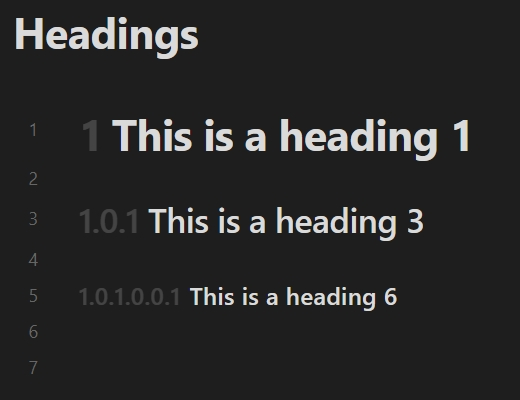

# Heading Decorator

## Introduction

This is a plugin for [Obsidian](https://obsidian.md).

Implement displaying specific content around headings based on their levels.

This plugin supports optional decoration for reading view, editing view (*Live Preview* and *Source mode*) and *[Outline](https://help.obsidian.md/plugins/outline)* plugin. This plugin does not modify any note content, only decorates the heading section based on the existing note content.

## Preview

In *Live Preview*:


The interaction between the decorator and the collapse button:


## Settings

### Metadata keyword

The key name that reads the enabled status from the [properties](https://help.obsidian.md/Editing+and+formatting/Properties). The default value is: `heading`. Usage reference: [Enabled status of notes](#enabled-status-of-notes).

### Enabled

The plugin supports configure heading decorator for each editor mode. You can control the effect range:

- **Enabled in reading view**: Allow to decorate the heading under the *Reading* view.
- **Enabled in live preview**: Allow to decorate the heading under the *Live Preview*.
- **Enabled in source mode**: Allow to decorate the heading under the *Source mode*.
- **Enabled in outline plugin**: Allow to decorate the heading under the *Outline* plugin.

In addition, you can enable the default status of each note within the *Manage* subpage. It mainly works together with [Enabled status of notes](#enabled-status-of-notes).

### Effect

Control the display effect of the decorator.

- **Ordered**: Toggle this setting to enable the decoration of headings as an [ordered](#ordered) or [unordered](#unordered) list.
- **Opacity**: Set the opacity of the heading decorator. The value is the form of percentage.
- **Position**: Set the position of the heading decorator. You can configure the content to appear before or after the heading.

### Ordered

Similar to the effect displayed in the [Preview](#preview).

You can control the counter style type and delimiter. There are two special types of counter styles:

- **Custom list styles**: Set custom list styles for ordered list. Using spaces to separate entries. 
- **Specified string**: Set a specified string for ordered list.

For example:

| Decimal numbers | Custom List Styles (using `Ⓐ Ⓑ Ⓒ`) | Specified String (using `#` with empty delimiter) |
| :-------------: | :----------------------------------: | :-----------------------------------------------: |
|  |  |  |

#### Based on the existing highest level

For the *Based on the existing highest level* setting, use the highest level of headings in the note as the base for ordered list. For example:

| Default | Based on the existing highest level |
| :-----: | :----------------------------------: |
|  |  |

#### Ignore the single heading at the top-level

For the *Ignore the single heading at the top-level* setting, if the top-level has only a single heading, exclude it when building an ordered list. This setting contains *Based on the existing highest level*, but it deals with more "aggressive". For example:

| Default | Ignore the single heading at the top-level |
| :-----: | :----------------------------------------: |
|  |  |

#### Allow zero level

For the *Allow zero level* setting, if the next heading is more than one level higher, the omitted level is zero instead of one. For example:

| Default | Allow zero level |
| :-----: | :--------------: |
|  |  |

### Unordered

Directly decorate the heading according to the level. For example:

| Ordered (Decimal numbers) | Unordered (using `H1 H2 H3 H4 H5 H6`) |
| :-----: | :--------------: |
|  |  |

## Enabled status of notes

This plugin allows for configure the enabled status based on specific fields in the note [properties](https://help.obsidian.md/Editing+and+formatting/Properties). You can individually control the enabled status of a note.

For example:

```yaml
---
heading:
  - reading: true  # Or yes, on, 1.
  - preview: false # Or no, off, 0.
  - source: false  # Fields are optional.
  - outline: ~     # Other values are equivalent to undeclared.
---
```

You can use `all` to set all status:

```yaml
---
heading:
  - all: false
---
```

Or directly after the field:

```yaml
---
heading: false
---
```

If you prefer to use Obsidian's `cssclasses` default property, you can also fill in `cssclasses` with some equivalent class names:

- reading: `enable-reading-heading`/`disable-reading-heading`
- preview: `enable-preview-heading`/`disable-preview-heading`
- source: `enable-source-heading`/`disable-source-heading`
- outline: `enable-outline-heading`/`disable-outline-heading`
- all: `enable-heading`/`disable-heading`

Like:

```yaml
---
cssclasses: disable-heading
---
```

## Credits

- [@jsamr/counter-style](https://github.com/jsamr/react-native-li/tree/master/packages/counter-style#readme)

## License

[MIT](/LICENSE) license
