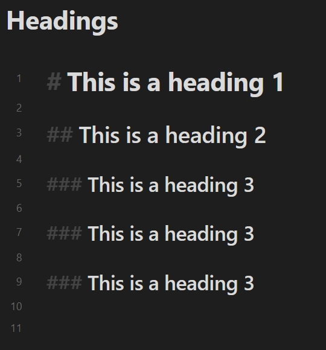
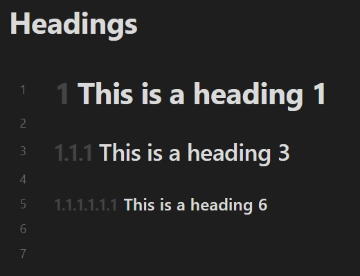

# Heading Decorator

> Obsidian Plugin

## Introduction

This is a plugin for [Obsidian](https://obsidian.md).

Implements the decoration of the heading.

This plugin supports optional decoration for reading view and editing view (*Live Preview* and *Source mode*). This plugin does not modify any note content, only decorates the heading section based on the existing note content.

## Preview

In *Live Preview*:

The interaction between the decorator and the collapse button:

## Settings

### Enabled

The plugin supports configure heading decorator for each editor mode. You can control the effect range:

- **Enabled in reading view**: Decorate the heading under the *Reading* view.
- **Enabled in live preview**: Decorate the heading under the *Live Preview*.
- **Enabled in source mode**: Decorate the heading under the *Source mode*.

### Effect

Control the display effect of the decorator.

- **Ordered**: Toggle this setting to enable the decoration of headings as an [ordered](#ordered) or [unordered](#unordered) list.
- **Opacity**: Set the opacity of the heading decorator. The value is the form of percentage.
- **Position**: Set the position of the heading decorator.

### Ordered

Similar to the effect displayed in the [Preview](#preview).

You can control the counter style type and delimiter. There are two special types of counter styles:

- **Custom list styles**: Set custom list styles for ordered list. Using spaces to separate entries. 
- **Specified string**: Set a specified string for ordered list.

For example:

| Decimal numbers | Custom List Styles (using `Ⓐ Ⓑ Ⓒ`) | Specified String (using `#` with empty delimiter) |
| :-------------: | :----------------------------------: | :-----------------------------------------------: |
|  |  |  |

In addition, for the *Ignore the single heading at the top-level* setting, if the top-level has only a single heading, exclude it when building an ordered list. For example:

| Default | Ignore the single heading at the top-level |
| :-----: | :----------------------------------------: |
|  |  |

For the *Allow zero level* setting, if the next heading is more than one level higher, the omitted level is zero instead of one. For example:

| Default | Allow zero level |
| :-----: | :--------------: |
|  |  |

### Unordered

Directly decorate the heading according to the level. For example:

| Ordered (Decimal numbers) | Unordered (using `H1 H2 H3 H4 H5 H6`) |
| :-----: | :--------------: |
|  |  |

## Credits

- [@jsamr/counter-style](https://github.com/jsamr/react-native-li/tree/master/packages/counter-style#readme)

## License

[MIT](/LICENSE) license
